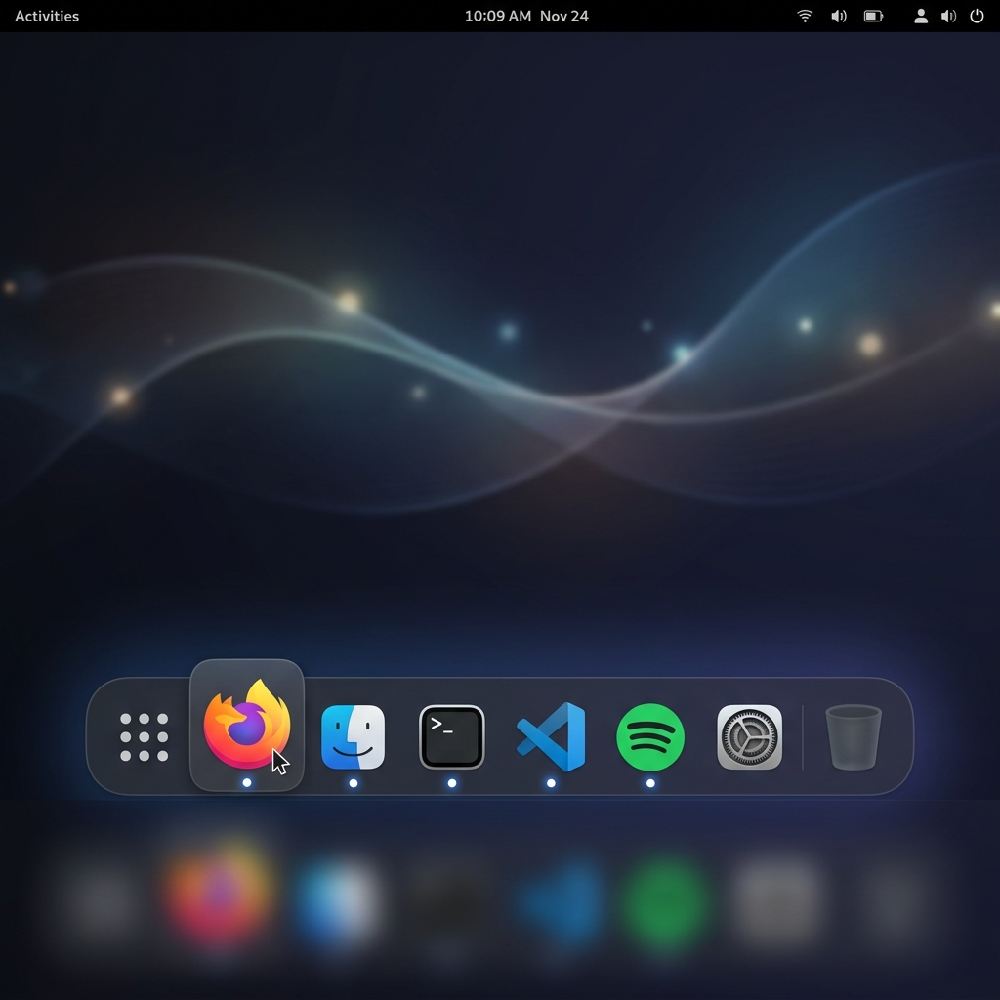

# GNOME Dock Extension for GNOME Shell

A modern, highly customizable GNOME Shell Dock extension inspired by **Dash to Dock**.



Built using modern **GNOME Shell ESM JS**, **St Widgets**, **Clutter**, and **LibAdwaita** preferences GUI for **GNOME Shell 45 through 50+**.

---

## ✨ Features

- 💎 **Glassmorphic & Dark Presets**:
  - Glassmorphic pill container with translucent blur aesthetic (`rgba(28, 28, 38, 0.65)`).
  - Charcoal & Classic Dark mode options.
  - Smooth **Icon Magnification** continuous zoom on hover.
  - Active running app indicators (glowing dots, accent bars, or lines).
  - **Trash Bin** integration (`trash:///` launcher & empty trash context menu).
  - Classic GNOME overview / App Grid launcher shortcut button.
- ⚡ **Intelligent Auto-Hide**:
  - Automatically hides when active windows overlap or touch the dock area.
  - Instant reveal on mouse hover proximity.
- ⚙️ **Rich Preference GUI (`prefs.js`)**:
  - Built natively with **LibAdwaita (`Adw.PreferencesWindow`)**.
  - Style Preset selection (Glassmorphic, Charcoal, Classic).
  - Screen placement (Bottom, Left, Right, Top).
  - Adjustable icon size (24px to 96px).
  - Translucency & corner radius controls.
  - Magnification scale factor adjustment (1.1x to 2.2x).
  - Running app indicator style selection.
  - App grid launcher position (Start or End of dock).
- 🖱️ **Interactive App Controls**:
  - **Left-click**: Launch app or focus/minimize active window.
  - **Middle-click**: Open new window instance.
  - **Right-click context menu**: Launch new window, Pin/Unpin from dock, Quit app.
  - **Tooltips**: Sleek floating dark tooltips displaying app names on hover.

---

## 🛠️ Project Structure

```
gnome-dock/
├── assets/
│   └── preview.png                                    # High-res extension preview image
├── metadata.json                                      # GNOME Shell extension metadata
├── stylesheet.css                                     # Glassmorphism & dock styles
├── extension.js                                       # Main GNOME 45+ Extension class
├── prefs.js                                           # LibAdwaita preferences window
├── dockContainer.js                                   # Main floating dock actor & autohide logic
├── dockItem.js                                        # Dock icon item widget, magnification & context menus
├── dockManager.js                                     # Tracks favorite apps & running process states
├── schemas/
│   └── org.gnome.shell.extensions.gnome-dock.gschema.xml  # GSettings schema XML
├── Makefile                                           # Build & installation commands
└── install.sh                                         # One-click installation script
```

---

## 🚀 Quick Start & Installation

### Option 1: Quick Install Script
```bash
./install.sh
```

### Option 2: Using Makefile
```bash
# Build schemas and install extension to ~/.local/share/gnome-shell/extensions/
make install
```

### Option 3: Package for GNOME Extensions Store (`extensions.gnome.org`)
```bash
make pack
```
This generates `gnome-dock@danilosalerno.shell-extension.zip` ready for uploading.

---

## ⚙️ Configuration & Preferences

To open the Preferences GUI:
```bash
gnome-extensions prefs gnome-dock@danilosalerno
```

Or open **GNOME Extensions** / **Extension Manager** app on your desktop and click settings next to **GNOME Dock**.

---

## 🔄 Applying Changes / Restarting GNOME Shell

- **Wayland**: Log out and log back in, or lock/unlock screen (`Super + L`).
- **X11**: Press `Alt + F2`, type `r`, and hit `Enter`.
